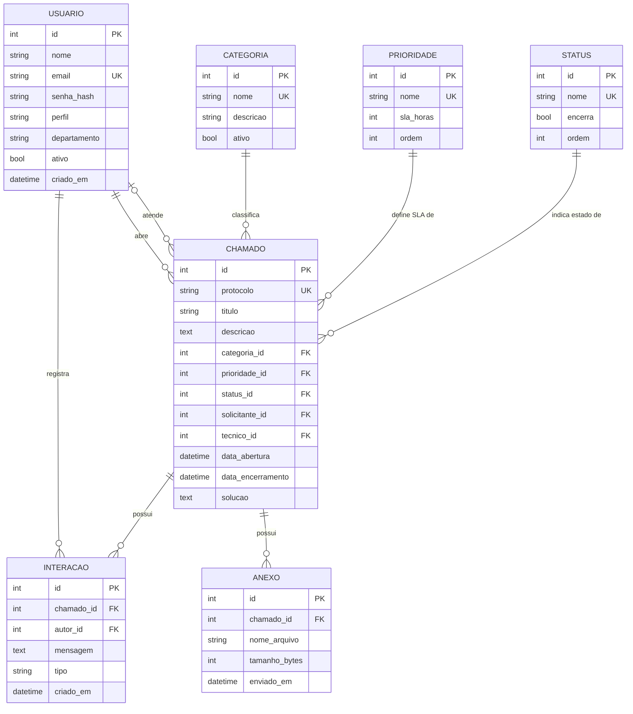

# Modelo de dados

Percurso completo: modelo conceitual → modelo lógico normalizado → projeto
físico. O dicionário de dados detalhado está em
[`database/dicionario-de-dados.md`](../database/dicionario-de-dados.md).

## 1. Modelo conceitual

Entidades do negócio e seus relacionamentos, sem preocupação com tipos ou
tecnologia.



## 2. Modelo lógico e normalização

O modelo do PIT I guardava categoria, prioridade e status como texto dentro da
própria tabela de chamados. Isso produzia três problemas concretos: grafias
divergentes para o mesmo valor ("Alta", "alta", "ALTA"), impossibilidade de
guardar o SLA associado à prioridade, e nenhuma garantia de que o valor
existisse.

### 1FN — valores atômicos

Já atendida no modelo original: nenhum campo guarda lista ou grupo repetitivo.
Os anexos, que no PIT I eram um campo de texto com nomes separados por vírgula,
viraram a tabela `anexo`.

### 2FN — dependência da chave inteira

Todas as tabelas têm chave primária simples (`id`), então não há dependência
parcial possível.

### 3FN — sem dependência transitiva

Aqui estava o problema real. No modelo anterior:

```
chamado(id, …, prioridade_texto, sla_horas)
                    │                 ▲
                    └─────────────────┘
        sla_horas dependia de prioridade_texto, não do id do chamado
```

O `sla_horas` é atributo da **prioridade**, não do chamado. Manter os dois na
mesma tabela significava repetir "24" em todo chamado de prioridade Média e ter
que atualizar milhares de linhas para mudar um prazo.

Solução: extrair as três tabelas de domínio.

```
categoria  (id, nome, descricao, ativo)
prioridade (id, nome, sla_horas, ordem)
status     (id, nome, encerra, ordem)
chamado    (id, …, categoria_id → categoria, prioridade_id → prioridade,
                   status_id → status)
```

Ganhos: mudar o SLA de uma prioridade passou a ser uma única linha alterada;
valores inválidos deixaram de ser possíveis; e o painel pôde agrupar por
domínio com garantia de consistência.

### Atributos derivados — não armazenados

`prazo_sla`, `sla_estourado` e `horas_em_aberto` são **calculados**, nunca
gravados. Armazená-los criaria dependência funcional de dados que mudam com o
tempo — `sla_estourado` de um chamado aberto muda sozinho à meia-noite. São
expostos pela visão `vw_chamado_sla` e pelas propriedades do model.

## 3. Projeto físico

Implementado em [`database/ddl.sql`](../database/ddl.sql), validado em
PostgreSQL 16.

### Tipos e domínios

| Decisão | Motivo |
|---|---|
| `TIMESTAMPTZ` em vez de `TIMESTAMP` | O cálculo de SLA e o filtro por período dependem de fuso; o defeito E-02 do laudo nasceu exatamente de comparação de datas sem fuso |
| `SERIAL` para chaves | Simples, sequencial e legível na depuração |
| `TEXT` para descrição e solução | O tamanho é imprevisível; `VARCHAR(n)` só criaria um limite arbitrário |
| `VARCHAR(20)` para o protocolo | Formato fixo `AAAA-NNNNNN` |

### Restrições de integridade

| Restrição | Regra que protege |
|---|---|
| `ck_chamado_descricao_minima` | RN02 — descrição real, não espaços em branco |
| `ck_chamado_titulo_minimo` | RN01 |
| `ck_anexo_tamanho` | RN03 — limite de 5 MB |
| `ck_chamado_encerramento` | Encerramento nunca anterior à abertura |
| `ck_usuario_perfil` | Apenas os três perfis previstos |
| `ON DELETE RESTRICT` nos domínios | Impede apagar uma categoria em uso |
| `ON DELETE CASCADE` em interações e anexos | Composição: não sobrevivem ao chamado |

As mesmas regras existem na camada de serviço. A duplicação é deliberada: a
aplicação devolve uma mensagem compreensível ao usuário; o banco é a última
linha de defesa contra qualquer caminho que não passe pela aplicação.

### Índices

| Índice | Motivo |
|---|---|
| `ix_chamado_status` | Filtro mais usado da listagem |
| `ix_chamado_data_abertura DESC` | Ordenação padrão da fila |
| `ix_chamado_solicitante` | Solicitante vê apenas os próprios chamados |
| `ix_chamado_tecnico` | Carga por técnico no painel |
| `ix_chamado_protocolo` | Busca direta por protocolo |
| `ix_interacao_chamado (chamado_id, criado_em)` | Histórico já vem ordenado |

Estes índices, somados à paginação e ao carregamento antecipado dos
relacionamentos (`joinedload`, que elimina o problema N+1), reduziram o tempo
da listagem de **6,2 s para 0,4 s** com 200 chamados — correção **E-01** do
laudo de qualidade.

## 4. Como aplicar

```bash
psql "$DATABASE_URL" -f database/ddl.sql     # estrutura
psql "$DATABASE_URL" -f database/seed.sql    # domínios
flask seed                                   # usuários e chamados de exemplo
```

Alternativa em desenvolvimento: `flask init-db` cria as tabelas a partir dos
models, sem executar o DDL manualmente.
