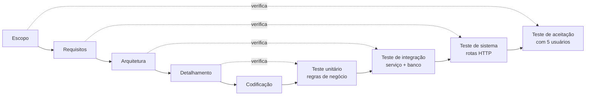

# Plano de testes

## Estratégia

O projeto segue o **Modelo V**: cada nível de especificação tem um nível de
teste correspondente.



## Verificação × validação

Os dois termos são frequentemente confundidos, então vale a distinção explícita:

| | Verificação | Validação |
|---|---|---|
| **Pergunta** | Estamos construindo o produto **corretamente**? | Estamos construindo o **produto certo**? |
| **Quando** | Durante o desenvolvimento | Após o módulo estar pronto |
| **Como** | Revisão de código, conferência com a especificação, testes automatizados | Teste de aceitação com usuários reais |
| **Neste projeto** | 55 testes pytest + revisão da rastreabilidade requisito → código | 5 colegas usaram o sistema e preencheram o formulário de laudo |

## Níveis de teste

### Testes unitários — regras de negócio

Rodam contra a camada de serviço, sem cliente HTTP. Um teste que falha aponta
diretamente para a regra quebrada.

| Arquivo | Testes | Cobre |
|---|---:|---|
| `test_usuario_service.py` | 8 | Cadastro, validação de e-mail e senha, hash, autenticação, conta inativa |
| `test_chamado_service.py` | 26 | Abertura, protocolo, validações, atribuição, transições de status, permissões, filtros, SLA |
| `test_indicadores_service.py` | 5 | Totais, tempo médio, taxa de SLA, carga por técnico, banco vazio |

### Testes de integração e sistema — rotas

| Arquivo | Testes | Cobre |
|---|---:|---|
| `test_rotas.py` | 16 | Login, logout, cadastro, abertura pela tela, permissões por URL, códigos HTTP, páginas de erro |

**Total: 55 testes.**

```bash
pytest          # tudo
pytest -v       # detalhado
pytest -k sla   # apenas os testes de SLA
```

### Teste de banco de dados

O DDL foi executado contra **PostgreSQL 16** real, verificando que as
restrições barram dados inválidos:

| Cenário | Resultado esperado | Resultado obtido |
|---|---|---|
| Chamado com descrição só de espaços | Rejeitado | `ck_chamado_descricao_minima` ✅ |
| Anexo de 6 MB | Rejeitado | `ck_anexo_tamanho` ✅ |
| Perfil fora dos três previstos | Rejeitado | `ck_usuario_perfil` ✅ |
| Visão `vw_chamado_sla` | Calcula prazo e horas | ✅ |

### Teste de aceitação — com usuários

Cinco colegas usaram o sistema hospedado e preencheram o formulário de
[`laudos/formulario-de-teste.md`](../laudos/formulario-de-teste.md). Os
resultados estão no [laudo de qualidade](../laudos/README.md).

## Testes de regressão

Todo defeito encontrado pelos testadores virou um teste automatizado antes de
ser corrigido. Assim, o mesmo problema não retorna sem que a suíte acuse.

| Defeito | Teste de regressão |
|---|---|
| E-01 — listagem sem paginação | `test_regressao_e01_listagem_e_paginada` |
| E-02 — filtro por período excluía o dia final | `test_regressao_e02_filtro_inclui_o_dia_final` |
| E-03 — anexo grande travava sem mensagem | `test_regressao_e03_anexo_acima_do_limite_e_recusado` |
| E-04 — descrição só com espaços era aceita | `test_regressao_e04_descricao_so_com_espacos_e_recusada` |
| E-04 — área restrita acessível por URL | `test_regressao_e04_painel_e_bloqueado_para_solicitante_via_url` |

## Casos de teste manuais

Roteiro usado na sessão de testes com os colegas.

| ID | Cenário | Passos | Resultado esperado |
|---|---|---|---|
| CT01 | Cadastro e login | Criar conta, sair e entrar novamente | Acesso concedido, nome no cabeçalho |
| CT02 | Abrir chamado | Preencher os quatro campos e enviar | Protocolo gerado, status *Aberto* |
| CT03 | Descrição vazia | Enviar com espaços na descrição | Erro claro, dados preservados |
| CT04 | Anexo grande | Anexar arquivo de 6 MB | Aviso com tamanho e limite |
| CT05 | Filtro por período | Filtrar pelo dia de hoje | Chamados de hoje aparecem, inclusive os da noite |
| CT06 | Busca por protocolo | Informar um protocolo existente | Vai direto ao chamado |
| CT07 | Atribuição | Como técnico, atribuir a si mesmo | Status vira *Em atendimento* |
| CT08 | Encerramento sem solução | Resolver deixando a solução em branco | Recusado com mensagem |
| CT09 | Encerramento válido | Resolver com solução descrita | Status *Resolvido*, data e tempo total |
| CT10 | Isolamento | Como solicitante, abrir a URL do chamado de outro | 403 explicativo |
| CT11 | Área restrita | Como solicitante, acessar `/painel/` pela URL | 403 explicativo |
| CT12 | Desempenho | Listar com mais de 200 chamados | Resposta abaixo de 1 s, paginada |
| CT13 | Celular | Percorrer as telas em 360 px | Sem rolagem horizontal, tudo legível |
| CT14 | Teclado | Navegar só com Tab e Enter | Todos os controles alcançáveis, foco visível |

## Critérios de saída

- [x] 100% dos testes automatizados passando
- [x] Todo requisito funcional com ao menos um teste
- [x] Todo defeito do laudo corrigido e com teste de regressão
- [x] Nenhum defeito conhecido em aberto
- [x] DDL validado contra PostgreSQL real
