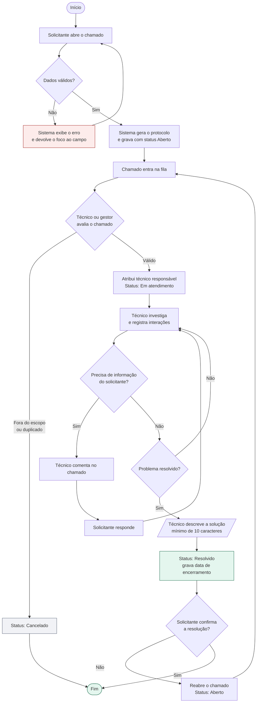

# Diagrama de atividades — Triagem e atendimento

## Contagem de SLA

O relógio do SLA começa na **abertura** e para no **encerramento**. O tempo em
que o chamado aguarda resposta do solicitante continua contando — decisão
consciente: pausar a contagem exigiria um status adicional ("Aguardando
solicitante") que ficou para a fase 2. Enquanto isso, o painel mostra o tempo
real de ponta a ponta, que é o que o usuário efetivamente sente.
