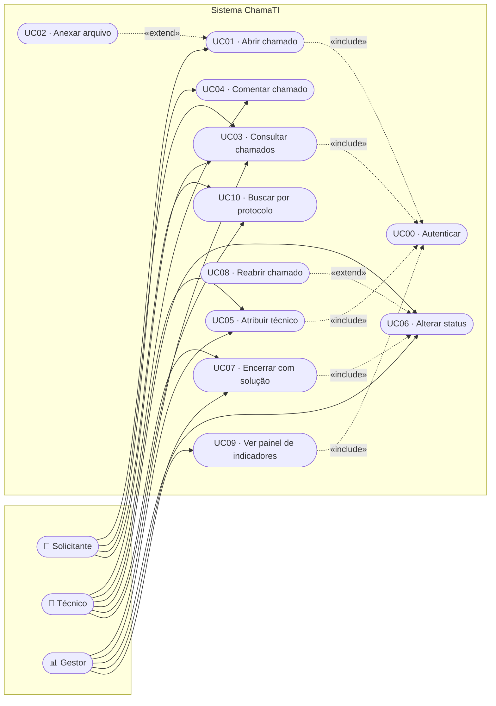

# Diagrama de casos de uso

## Descrição dos casos de uso principais

### UC01 — Abrir chamado

| | |
|---|---|
| **Ator principal** | Solicitante |
| **Pré-condição** | Usuário autenticado |
| **Pós-condição** | Chamado criado com status *Aberto* e protocolo único |

**Fluxo principal**

1. O solicitante acessa "Abrir chamado".
2. Preenche título, descrição, categoria e prioridade.
3. Opcionalmente, anexa arquivos (`«extend»` UC02).
4. Envia o formulário.
5. O sistema valida os dados no servidor.
6. O sistema gera o protocolo, grava o chamado e registra a interação inicial.
7. O sistema exibe a tela do chamado com a confirmação.

**Fluxos alternativos**

- **A1 — Descrição insuficiente:** o sistema recusa o envio, exibe a mensagem
  explicando o mínimo exigido e devolve o foco ao campo, preservando o que já
  foi digitado.
- **A2 — Anexo acima de 5 MB:** o sistema informa o tamanho do arquivo e o
  limite permitido, e sugere compactar ou reduzir a imagem.

### UC07 — Encerrar com solução

| | |
|---|---|
| **Ator principal** | Técnico (ou Gestor) |
| **Pré-condição** | Chamado com status *Em atendimento* |
| **Pós-condição** | Status *Resolvido*, data de encerramento e solução gravadas |

**Fluxo principal**

1. O técnico abre o chamado e escolhe o status *Resolvido*.
2. O sistema exibe o campo de solução.
3. O técnico descreve a causa e a correção aplicada.
4. O sistema valida a transição e o tamanho mínimo da solução.
5. O sistema grava o encerramento e registra a mudança no histórico.

**Fluxos alternativos**

- **A1 — Solução ausente ou curta demais:** o sistema recusa o encerramento.
- **A2 — Transição inválida** (ex.: *Aberto* → *Resolvido*): o sistema recusa e
  orienta a consultar o fluxo de atendimento.
- **A3 — Solicitante tentando resolver:** o sistema nega a permissão.
