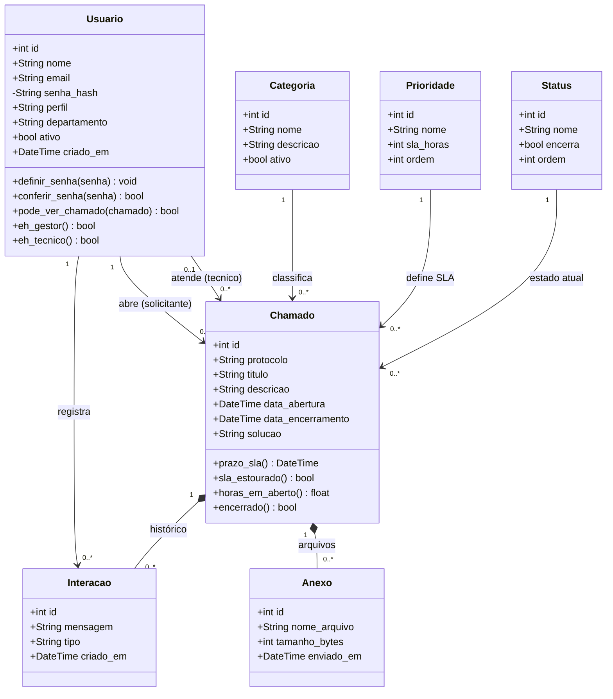

# Diagrama de classes

Classes de persistência do domínio. As multiplicidades — ausentes na entrega do
PIT I — estão explícitas, e as classes de domínio (`Categoria`, `Prioridade`,
`Status`) substituíram os campos de texto livre do modelo anterior.

## Notas de modelagem

**Composição × associação.** `Interacao` e `Anexo` são composições de `Chamado`:
não existem fora dele e são removidos junto (`ON DELETE CASCADE`). Já
`Categoria`, `Prioridade` e `Status` são associações — existem
independentemente e não podem ser apagados enquanto houver chamado apontando
para eles (`ON DELETE RESTRICT`).

**Duas associações entre `Usuario` e `Chamado`.** Uma pessoa participa do
chamado em dois papéis distintos — solicitante (obrigatório) e técnico
(opcional). No banco, isso vira duas chaves estrangeiras para a mesma tabela.

**`Perfil` não virou tabela.** É um enumerado estável de três valores, validado
por `CHECK` no banco. Uma tabela aqui só acrescentaria uma junção em toda
consulta, sem ganho.

**`senha_hash` é privado.** A senha nunca é lida diretamente: entra por
`definir_senha()` e é conferida por `conferir_senha()`.

**Métodos calculados no model.** `prazo_sla`, `sla_estourado` e
`horas_em_aberto` são propriedades da própria entidade, não do serviço — são
características intrínsecas do chamado, e mantê-las juntas dos dados evita
duplicar a fórmula em cada lugar que precisa dela.
