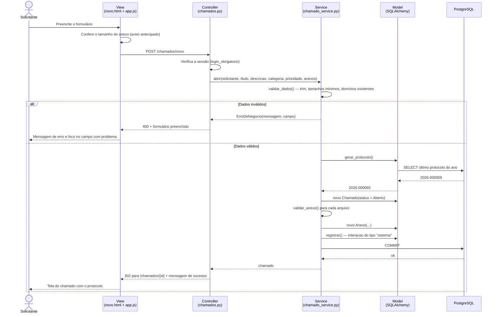

# Diagrama de sequência — Abrir chamado

Mostra o percurso da requisição pelas camadas MVC, incluindo o caminho de erro.

## Pontos de atenção

- A conferência do anexo no navegador é **cortesia**, não segurança: o serviço
  refaz a verificação. Um envio direto por `curl` cai na mesma regra.
- O protocolo é gerado dentro da transação, junto com a inserção do chamado.
- A interação inicial do tipo `sistema` garante que todo chamado nasça com
  histórico — nenhum registro fica sem rastro de origem.
