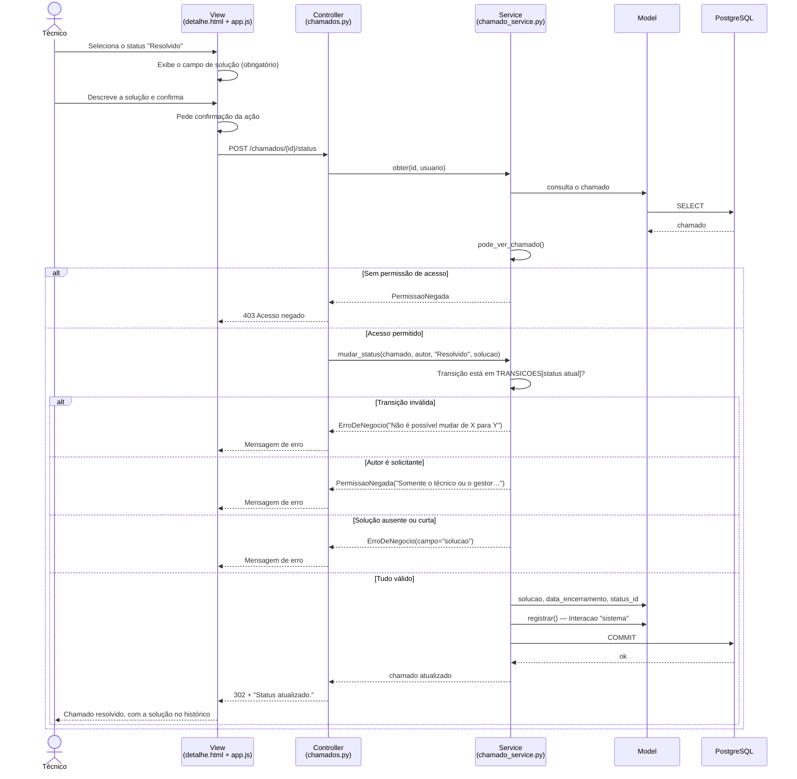

# Diagrama de sequência — Encerrar chamado

## Regras exercitadas neste fluxo

| Regra | Efeito |
|---|---|
| RN04 | Só encerra a partir de *Em atendimento* |
| RN05 | Solicitante não resolve o próprio chamado |
| RN06 | Solução com no mínimo 10 caracteres |
| RN07 | O chamado precisa ser visível para quem age sobre ele |
